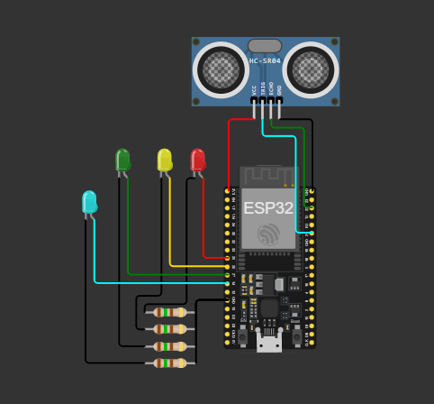
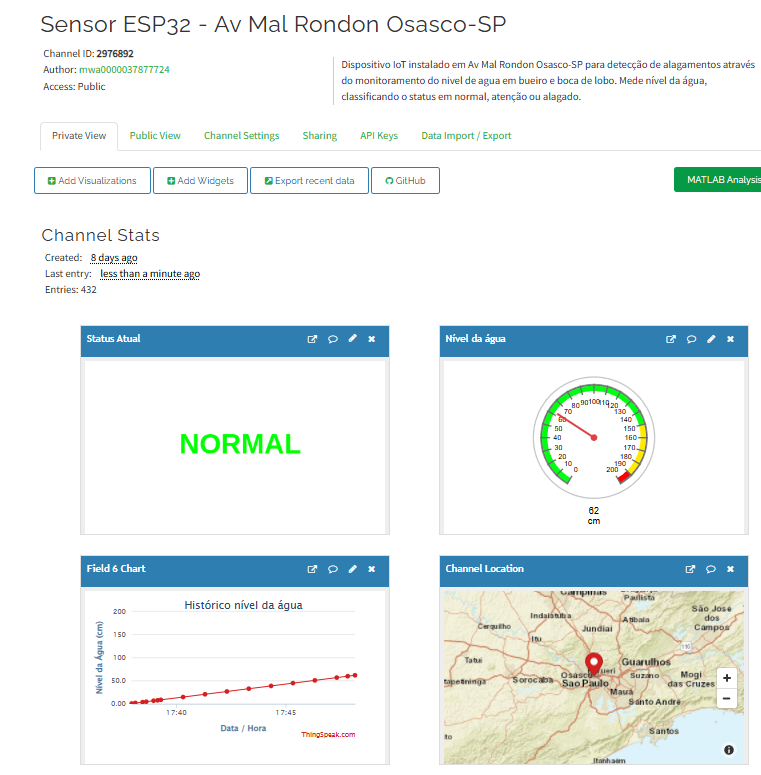

# Lugia Weather – Monitoramento de Nível de Água com ESP32

## Descrição da Solução

O **Lugia Weather** é um sistema IoT para monitoramento de nível de água em bueiros, utilizando ESP32, sensor ultrassônico (HC-SR04) e LEDs indicadores. Os dados coletados são enviados via MQTT para o [ThingSpeak](https://thingspeak.mathworks.com/channels/2976892), permitindo acompanhamento remoto em tempo real.

O sistema indica o status do nível de água (NORMAL, ATENÇÃO, ALAGADO) por meio de LEDs e envia informações detalhadas para o broker MQTT, facilitando a análise e tomada de decisão.

---

## Imagem do Diagrama de Montagem



---

## Imagem do Dashboard ThingSpeak



---

## Estrutura do Projeto

```
Lugia Weather/
├── LICENSE
├── platformio.ini
├── README.md
├── dashboard.png
├── diagram.png
├── docs/
│   ├── diagram.json
│   └── wokwi.toml
└── src/
    └── main.cpp
```

---

## Dependências do Projeto

As dependências são gerenciadas automaticamente pelo PlatformIO através do arquivo `platformio.ini`:

- **Plataforma:** espressif32
- **Placa:** esp32dev
- **Framework:** arduino
- **Bibliotecas:**
  - knolleary/PubSubClient@^2.8

---

## Instruções para Simulação (Importação do Projeto)

### 1. Pré-requisitos

- [VS Code](https://code.visualstudio.com/) instalado
- [PlatformIO IDE](https://platformio.org/install/ide?install=vscode) instalado no VS Code
- [Wokwi Simulator Extension](https://marketplace.visualstudio.com/items?itemName=wokwi.wokwi-vscode) instalada no VS Code

### 2. Como Simular

1. Baixe ou clone este repositório em seu computador:
   ```sh
   git clone https://github.com/Lugia-Weather/iot.git
   ```
2. Abra a pasta do projeto pelo PlatformIO.
3. O PlatformIO irá detectar e instalar automaticamente as dependências.
4. Clique em **Run > Start Debugging** ou utilize o botão de upload para compilar e simular o projeto.
5. Clique em **/docs/diagram.json** ative sua licença do Wokwi se não tiver e inicie a simulação.
6. Os dados enviados via MQTT podem ser visualizados no [ThingSpeak - Canal 2976892](https://thingspeak.mathworks.com/channels/2976892).

---

## Dados Enviados via MQTT

A cada 10 segundos, o dispositivo envia para o ThingSpeak os seguintes dados no payload MQTT:

- **field1**: Nome do projeto (`lugia_weather`)
- **field2**: ID do módulo IoT (`esp32_bueiro_1`)
- **field3**: IP local do Wi-Fi
- **field4**: MAC Address do ESP32
- **field5**: Distância medida pelo sensor (cm)
- **field6**: Nível de água calculado (cm)
- **field7**: Status do nível de água (0 = NORMAL, 1 = ATENÇÃO, 2 = ALAGADO)

Exemplo de payload:

```
field1=lugia_weather&field2=esp32_bueiro_1&field3=192.168.0.10&field4=AA:BB:CC:DD:EE:FF&field5=150.00&field6=50.00&field7=1
```

---

## Dados Impressos no Serial Monitor

O monitor serial exibe, a cada ciclo:

- Nível da água (cm)
- Distância medida (cm)
- Status textual (NORMAL, ATENÇÃO, ALAGADO)
- Payload enviado via MQTT (formatado)
- Mensagens de conexão Wi-Fi e MQTT
- Mensagens de erro em caso de falha de envio

---

## Possíveis Erros Tratados

- **Falha na conexão Wi-Fi**: O sistema tenta reconectar automaticamente.
- **Falha na conexão MQTT**: O sistema tenta reconectar automaticamente ao broker.
- **Falha ao enviar mensagem MQTT**: Mensagem de erro exibida no serial, com código de erro MQTT.
- **Erro de leitura do sensor**: Se não houver resposta do sensor, retorna -1 e o valor não é considerado válido.

---

## Apresentação do Código-Fonte

O código está em [`src/main.cpp`](src/main.cpp), com comentários detalhados em cada função:

- **Conexão Wi-Fi e MQTT**: Funções `initWifi()`, `initMQTT()`, `verificaConexoes()`
- **Leitura do sensor ultrassônico**: Função `leituraDistanciaCm()`
- **Cálculo do nível de água**: Função `calcularNivelAguaCm()`
- **Indicação por LEDs**: Controle dos pinos 25, 26, 27 e 14
- **Envio de dados via MQTT**: Função `enviaEstadoOutputMQTT()`
- **Tratamento de erros**: Mensagens e reconexão automática

---

## Licença

Este projeto está licenciado sob a Licença MIT. Veja o arquivo [`LICENSE`](LICENSE) para mais detalhes.

## 👨‍💻 Autor

### **Júlio César Nunes Oliveira - RM557774 2TDSFPF** - [GitHub](https://github.com/jubshereman)

### **Erik Paschoalatto dos Santos - RM554854 2TDSFPF** - [GitHub](https://github.com/ozerikoz)

### **Nathan Magno Gustavo Consolo - RM558987 2TDSFPF** - [GitHub](https://github.com/NathanMagno)
